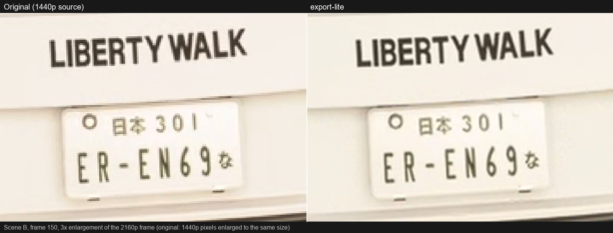
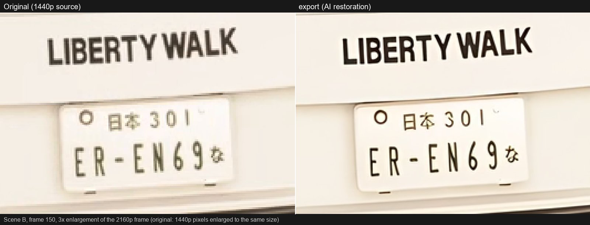
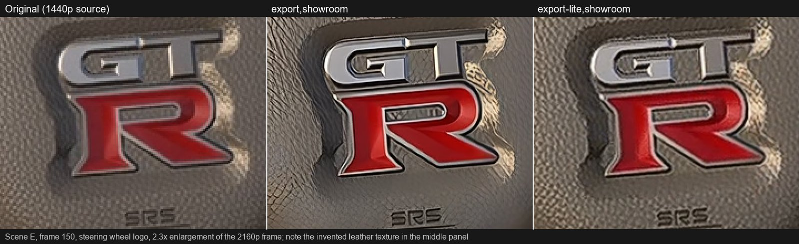
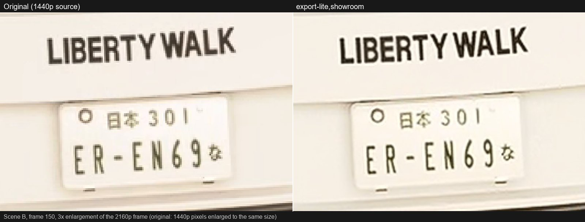
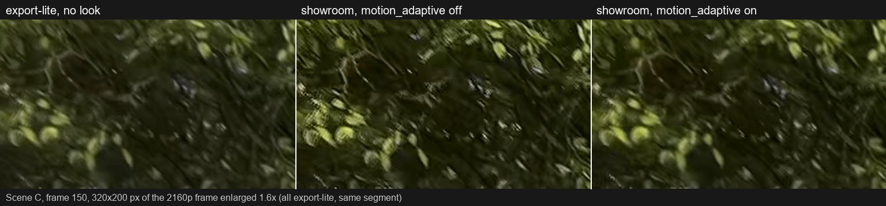

# Video-Enhancer

A local pipeline (Windows, NVIDIA GPU, Python 3.12) that moves Forza Horizon gameplay recordings towards a "camera image":
motion blur from interpolated sub-frames, upscaling, deblocking, film grain, lens effects and colour grading through 3D LUTs.

> **Honest note:** The pipeline shifts the *look* of the footage (blur, grain, grading, lens effects). It does **not create
> photorealism**. Geometry, textures, lighting and materials remain game graphics. A diffusion stage that could do more is
> **not built in yet** (see [Diffusion](#diffusion-not-available-yet)).

Everything runs locally, nothing is uploaded. Intended for private use.

> **Note:** The console messages of the tool are currently in German. The troubleshooting table below quotes them verbatim and explains them.

## How it works

```
source (FFmpeg, rawvideo pipe) -> [deblock/deband] -> [RIFE + shutter blend] -> [Real-ESRGAN | Lanczos]
        -> FFmpeg filter graph inside the encoder: softness, CA, bloom, halation, vignette, LUT, grain -> NVENC
```

* Streaming: no PNG folders; frames travel from FFmpeg through the GPU stages into the encoder via pipes.
* Segments (default 20 s) with resume: an interrupted run continues with the same command, finished segments are skipped.
* The original audio is copied 1:1, the segments are joined losslessly.
* Every run produces a comparison (original left, result right) as a video and as 5 stills.

## Requirements

* Windows 10/11, NVIDIA GPU with 12 GB VRAM recommended (tested: RTX 4070). Measured in the 2-minute run with `export-lite,cinematic`: peak 5.8 GB VRAM in total (about 1.5 GB of it desktop), Python about 1.5 GB RAM, FFmpeg processes about 3.4 GB RAM; flat over 29 minutes, no leak. The AI restoration alone needs about 1 GB VRAM.
* NVENC (HEVC; AV1 only on the RTX 40 series and newer), current NVIDIA driver.
* Python 3.12, FFmpeg (`libvmaf` is only needed for your own measurements).

## Installation

```powershell
# 1. Python 3.12 and FFmpeg (Gyan full build)
winget install -e --id Python.Python.3.12 --scope user
winget install -e --id Gyan.FFmpeg --scope user
# then open a new shell so that PATH is updated

# 2. virtual environment
py -3.12 -m venv .venv
.\.venv\Scripts\python -m pip install --upgrade pip

# 3. PyTorch with CUDA 13.0 (driver with CUDA >= 13.0, verified with driver 617.14), then the remaining packages
.\.venv\Scripts\python -m pip install --index-url https://download.pytorch.org/whl/cu130 torch==2.14.1 torchvision==0.29.1
.\.venv\Scripts\python -m pip install -r requirements.txt
```

Older drivers: choose the matching wheel index (`cu126`, `cu128`) and adjust the versions accordingly.
`find_tool` looks for FFmpeg in `PATH` and in the WinGet folder; if it is missing, the error message gives the install command.

### Model weights

The weights are **not in the repository** (`models/` is in `.gitignore`). Download them once into the `models/` folder:

```powershell
mkdir models
curl.exe -L -o models/realesr-general-x4v3.pth     https://github.com/xinntao/Real-ESRGAN/releases/download/v0.2.5.0/realesr-general-x4v3.pth
curl.exe -L -o models/realesr-general-wdn-x4v3.pth https://github.com/xinntao/Real-ESRGAN/releases/download/v0.2.5.0/realesr-general-wdn-x4v3.pth
curl.exe -L -o models/flownet_v4.25.pkl            https://github.com/HolyWu/vs-rife/releases/download/model/flownet_v4.25.pkl
# optional, only for tools/bench_restore.py (not used by any preset):
curl.exe -L -o models/RealESRGAN_x4plus.pth        https://github.com/xinntao/Real-ESRGAN/releases/download/v0.1.0/RealESRGAN_x4plus.pth
```

| File | Used for | Size (bytes) | SHA256 of the verified file* |
|---|---|---|---|
| `realesr-general-x4v3.pth` | AI restoration (`export`) | 4,885,111 | `8dc7edb9ac80ccdc30c3a5dca6616509367f05fbc184ad95b731f05bece96292` |
| `realesr-general-wdn-x4v3.pth` | Denoising (blended with the file above) | 4,885,111 | `1641f8c4464b9f097c9fdda5589273713f67cf59f3d909e0bd688f0cee269dca` |
| `flownet_v4.25.pkl` | RIFE v4.25 (motion blur) | 24,636,301 | `6615790efd627772917205db291f51cd392528a157ecbb2ecaeec3bff8eb6de2` |
| `RealESRGAN_x4plus.pth` | benchmark only | 67,040,989 | `4fa0d38905f75ac06eb49a7951b426670021be3018265fd191d2125df9d682f1` |

\* These are the checksums of the files the pipeline was developed with, not official values from the authors.
`flownet_v4.25.pkl` is read with `torch.load(..., weights_only=True)` (no code is executed from the file).

The LUTs (`luts/*.cube`) are part of the repository; missing default LUTs are regenerated by `python pipeline/luts.py`.

## Quick start

```powershell
# short test: 10 s from second 40 with the fast draft preset and a look
.\.venv\Scripts\python enhance.py "C:\path\clip.mp4" -p draft,cinematic --start 40 --duration 10

# 2160p60, Lanczos upscale, look (base preset first, look preset last)
.\.venv\Scripts\python enhance.py "C:\path\clip.mp4" -p export-lite,cinematic

# with AI restoration (for clips with text and licence plates)
.\.venv\Scripts\python enhance.py "C:\path\clip.mp4" -p export,dashcam-real

# 1440p60 without resizing, AV1 instead of HEVC
.\.venv\Scripts\python enhance.py "C:\path\clip.mp4" -p export1440,subtle,av1

# override single values
.\.venv\Scripts\python enhance.py "C:\path\clip.mp4" -p export-lite,cinematic --set encode.bitrate=60M --set look.grain.strength=4
```

`python enhance.py -h` lists all options. Result: `output/<name>_<preset>.mp4` and `output/<name>_<preset>_compare/` (`compare.mp4` + `still_1..5.png`,
can be disabled with `--no-compare`). Abort with Ctrl+C; the same command resumes. If the output is already finished, the file is skipped
(`--overwrite` rewrites it and reuses finished segments from `work/`; to re-render completely, delete the matching folder in `work/`).

## Batch mode

Several files or a whole folder are processed one after another with the same preset:

```powershell
# all videos in a folder (mp4, mkv, mov, m4v, webm, avi; not recursive)
.\.venv\Scripts\python enhance.py -p export-lite,cinematic --input-dir clips\ --output-dir out\

# or individual files
.\.venv\Scripts\python enhance.py a.mp4 b.mp4 -p export-lite,cinematic --output-dir out\
```

* An error in one file (corrupt file, encoder crash, unexpected error) does **not** abort the rest; it is logged and the batch continues.
* At the end a summary lists file, duration of the processed video, time taken and result (printed as `ok`, `uebersprungen` = skipped, `FEHLER` = error, `nicht verarbeitet` = not processed).
  The exit code is 1 if at least one file failed; on Ctrl+C the exit code is 130 and the remaining files appear as `nicht verarbeitet` in the summary.
* Already finished outputs are skipped (`--overwrite` forces rewriting). An interrupted file resumes through its segments on the next call.
* Output names: `<name>_<preset>.mp4` in the output folder. Identical file names from different folders are rejected before the start; `-o` only works for a single file.
* If the output and input folders are the same, results are not read again as input. `--start`/`--duration` apply to all files.

## Presets

Presets can be combined; later ones override earlier ones. Order: **base, look, encoder**.

| Base preset | What it does | Time per video minute* |
|---|---|---|
| `passthrough` | decode and encode only (pipe test) | not measured |
| `draft` | 1440p60, no stages, fast HEVC encode; for developing and comparing looks | 0.6 min without look, 4.9 min with look (the CPU look is the bottleneck) |
| `export1440` | 1440p60 without resizing, deblock + deband, motion blur (4 samples), HEVC 45M, 10-bit | 13–14 min |
| `export-lite` | 2160p60, Lanczos on the GPU, deblock + deband, motion blur, AV1 80M, 10-bit | 13.5 min (+ about 0.7 min for the automatic comparison) |
| `export` | like `export-lite`, but with AI restoration (Real-ESRGAN general-x4v3, tile 384), HEVC 80M | about 34 min |

\* 1440p60 source, measured on an RTX 4070 + Ryzen 5 7600 with 10 s clips and the 2-minute run; look presets cost nothing extra with the `export*` presets
because the look runs in parallel in the encoder process. The look alone manages 5.2 fps at 2160p and 11.8 fps at 1440p on the CPU,
so it only slows down `draft`. Real times vary by about ±10 % depending on source and system.

| Look preset | Character | Grain (strength) | LUT |
|---|---|---|---|
| `subtle` | light grading, hardly any lens effects | 2.3 | `subtle` |
| `cinematic` | full camera look, warmer tone, moderate grain | 3.5 | `cinematic` |
| `dashcam-real` | flat, desaturated, lifted blacks, strong grain | 5.6 | `dashcam` |
| `showroom` | sharp and punchy, no grain, vignette, CA or blur (see below) | none | none |

Look presets switch the encoder to **HEVC**; `av1` as the last preset selects AV1, `hevc` forces HEVC.
(`export-lite` alone, without a look, uses AV1.)

### The `showroom` look

`showroom` combines with `export`, `export-lite`, `export1440` and `draft` (`-p export-lite,showroom`). It works on luma only
and in this order: global tone curve (per channel, black point 0.01, S-curve 0.25, gamma 1.10, highlights fade back to the input so they are
not lifted into clipping) -> weak large-radius local contrast (`look.clarity`, hidden in highlights and deep shadows) -> two-stage sharpening
(`look.sharpen`: FFmpeg `cas` plus a small-radius unsharp mask whose added detail is capped, blended in through an edge and shadow mask, so sky,
smooth paint and dark noisy areas stay untouched) -> FFmpeg `vibrance` 0.15. The sharpening level is "strong" by default (`look.sharpen.level`): the strongest level without visible halos
on body edges, rims, logos and lettering (measured with `tools/bench_sharpen.py`). Weaker levels `medium` and `mild` are selected with `--set look.sharpen.level=medium`; the level table is in `presets.yaml` (`look.sharpen.levels`). A stronger level ("strong+": `cas 0.9`, `micro.amount 1.8`,
`micro.limit 22`) shows fine rims at tail lights and logos and is not used. The luma stage alone runs at about 18 fps at 2160p on the CPU.
Sharpening makes existing detail crisper (about 1.3-1.4x edge strength); it cannot add detail that the game footage does not contain.

`showroom` enables `look.sharpen.motion_adaptive` (amount 1.0, `lo` 9, `hi` 20, in 8-bit levels): the sharpening mask is also reduced where
the picture changes from one frame to the next (blurred |frame - previous frame|, smoothstep between `lo` and `hi`). Sharpening motion-blurred
foliage otherwise amplifies the encoder's block structure into a comb or streak pattern and flicker. Effect, measured on the fast foliage
scene C: edge gain 1.39x -> 1.03x, flicker flip rate 9.7 % -> 4 %; static edges (logos, instruments, lettering) keep most of their sharpening,
edges that move in the frame are attenuated too (car edges in B about -5 %). **The thresholds 9/20 were tuned on scene C only**; other footage
may need other values (`--set look.sharpen.motion_adaptive.lo=...`). The mask cannot tell moving content from moving camera: in the rainy scene A (fast camera, reflections, spray, drops) the edge gain of those regions drops from about 1.4-1.6x to 1.1-1.3x, but stays above the unsharpened base. Switch it off with `--set look.sharpen.motion_adaptive=off`.
`showroom` also sets `motion.samples: 4` (effective when the base preset enables the motion blur; 2 samples show double contours on fast motion).

Encoder: with `export`, `export-lite` and a 2160p source the combination `-p export,showroom` / `-p export-lite,showroom` encodes with `hevc_nvenc`
at 80 Mbit/s, 10-bit (VMAF 4K against a lossless render of the look: 99.5-99.9 at 80M, 97.2-99.4 at 50M, 99.8-100 at 100M; the file bitrate runs
about 8-10 % above the nominal value). The comb pattern in fast foliage is already in the lossless render, i.e. it comes from the sharpening and not
from the encoder, and stays at every bitrate.

### HEVC or AV1?

| | HEVC (`hevc_nvenc`) | AV1 (`av1_nvenc`) |
|---|---|---|
| Grain retention after the encoder (share of the real grain) | 0.68 (1440p/45M), 0.77 (2160p/80M) | 0.63 (1440p/45M), 0.73 (2160p/80M) |
| Image structure (VMAF, 1440p/45M, with grain) | 93.6 | 95.3 |
| Compatibility | plays practically everywhere (hardware decoders in almost every device) | needs newer players/hardware decoders; encoding only on RTX 40 and newer |

HEVC is the default of the look presets because the grain character matters more here than the VMAF score. NVENC smooths grain in general:
at 45M/1440p only about two thirds of the grain survive, which is why the strengths of the look presets are set about 25 % above the lossless target value.
Coarser grain (`look.grain.size`, default 2.0 px at 1080p) survives better than fine grain.

### Reproducibility and resume

Two runs with the same configuration produce byte-identical files (verified with `export-lite,cinematic` over a complete 20 s segment, 1200 frames at 2160p); the grain pattern is fixed per segment but differs from segment to segment.
Resume: a run that was killed hard in the middle of segment 4 of 6 continues with the same command, the finished segments stay unchanged (MD5 verified), only the interrupted segment is rendered again.
The work folders (`work/<name>_<preset>_<hash>`) contain the segments; they may be deleted after the run.

## Examples

The pipeline shifts the look of the footage; it does not produce photorealism and it cannot add detail the game footage does not contain.
All images are crops of the same frame (scene B, frame 150: rear of a car with lettering and a licence plate) unless noted, enlarged so that
single pixels are visible. The left side is always the 1440p source frame enlarged to the same size. The images are cut from the author's own
gameplay recordings (Forza Horizon 6) and only serve to demonstrate the modes. All numbers are **measured** on an RTX 4070 (times: 2-minute run; edge strength and flicker: 8-second clips; edge strength = mean
gradient of the luma in the region, relative to the same render without a look).

| Mode | Image | What it does | Time per video minute | Note |
|---|---|---|---|---|
| `export-lite` | [B150](docs/images/b150_export-lite_vs_original.jpg) | Lanczos upscale to 2160p, deblock + deband, motion blur (4 samples) | 13.5 min (measured) | Smooth enlargement, nothing invented; text stays as soft as the source |
| `export` | [B150](docs/images/b150_export_vs_original.jpg), [E150](docs/images/e150_export_vs_export-lite_cockpit.jpg) | like `export-lite`, but AI restoration (Real-ESRGAN general-x4v3) | 34 min (measured) | Crisper lettering and plate; the letters match the source in this frame. **Weakness:** it invents texture on organic surfaces (leather of the steering wheel) |
| `export-lite,showroom` | [B150](docs/images/b150_showroom_vs_original.jpg) | tone curve, weak clarity, two-stage masked sharpening (`strong`), vibrance | no extra time (measured: the look runs in parallel to the encoder) | Edge strength in scene B 1.16x-1.41x of the plain `export-lite` render; sharper, not more detailed |
| `showroom`, `motion_adaptive` off/on | [C150](docs/images/c150_showroom_motion-adaptive_off_vs_on.jpg) | attenuates the sharpening where the picture changes between frames | no extra time (measured) | **Without it**, `strong` sharpening turns motion-blurred foliage into a comb/streak pattern (edge gain 1.60x, flip rate 8.6 %); with it 1.18x and 3.1 % (measured, scene C) |

The grain looks `subtle`, `cinematic` and `dashcam-real` are not shown here.

### export-lite and export



*`export-lite`: a plain, clean enlargement; the lettering is as soft as in the source.*



*`export`: lettering and plate are clearly crisper and the characters match the source.*



*Weakness of `export`: the regular leather grain of the original is replaced by invented, swirly lines (middle) and small marks appear inside the "R";
`export-lite` (right) stays true to the source. Use `export` for clips with lettering and plates in the foreground, not for clips dominated by organic textures.*

### showroom



*`export-lite,showroom`: stronger contrast, warmer colours and sharper edges; the lettering is not more detailed than in the source.*



*Fast, motion-blurred foliage (320x200 px of the 2160p frame, enlarged 1.6x). Middle: comb and streak pattern from the sharpening; right: `motion_adaptive` on
(the default of `showroom`). The mask cannot tell a moving camera from a moving subject: in the rainy scene A the edge gain of reflections, spray and drops falls from about 1.4-1.6x
to 1.1-1.3x (measured). The thresholds were tuned on scene C.*

## Configuration

All values are in [presets.yaml](presets.yaml) (`defaults`, `presets`). Load your own file with `--config my.yaml`.
Override single values with `--set section.key=value`. Important sections:

* `segment_seconds`, `segment_overlap_seconds` (context for the motion blur; 4 frames are enough for seamless transitions)
* `restore`: `model` (`none`, `lanczos`, `general-x4v3`), `denoise`, `tile`, `target_height`, `classic.deblock/deband`
* `motion`: `out_fps`, `samples` (sub-frames per output frame), `shutter_angle`, `blend_gamma`, `flow_scale`
* `look`: `lut`, `softness`, `ca`, `bloom`, `halation`, `vignette`, `grain`, `tone`, `clarity`, `sharpen` (all strengths are relative to the image size, so 1440p and 2160p look the same)
* `encode`: `codec`, `bitrate`, `crf`/CQ, `preset`, `pix_fmt`

**Your own LUTs:** put a `.cube` file (any size, 3D) into `luts/` and set `look.lut: name`; existing files are never overwritten.

## Troubleshooting

The messages are printed in German; the table quotes them as printed.

| Message | Cause and remedy |
|---|---|
| `'ffmpeg' nicht gefunden` | FFmpeg not found: install it (see above) and open a new shell |
| `Modell fehlt` / `RIFE-Gewichte fehlen` | Model / RIFE weights missing: download the weights ([Model weights](#model-weights)) |
| `Keine CUDA-GPU gefunden` | No CUDA GPU found: check the NVIDIA driver (`nvidia-smi`) and whether the CUDA build of PyTorch is installed |
| `GPU-Speicher reicht nicht` | Not enough GPU memory: use a smaller `restore.tile` (e.g. 256), close other GPU programs |
| `Datei nicht lesbar oder defekt` | File unreadable or corrupt: check the source with `ffprobe`, re-record if necessary |
| `Segment hat N statt M Frames` | Segment has N instead of M frames: the source ends early or is damaged |
| HDR warning | HDR is not handled, colours will be wrong (SDR/BT.709 recording required) |
| Variable frame rate warning | the source is resampled to its peak frame rate while decoding (fps filter), frames are repeated |

## Limitations

* Windows and NVIDIA (NVENC) required; tested only with 1440p60 H.264 sources in SDR/BT.709.
* The HUD is treated like the rest of the image (interpolated and blurred as well); recordings without HUD are intended.
* The look graph runs on the CPU (16-bit); about 5 fps at 2160p.
* Segment boundaries: the motion blur is bit-identical to a single-segment run (tested, 4 frames of context are enough). In the 2-minute run (6 segments) the picture does not jump at any boundary; only the first frame of each segment has 5–18 % more grain (keyframe start of the encoder, one frame long, hardly visible). The grain does not repeat from segment to segment.
* Lanczos and Real-ESRGAN upscaling do not invent details; `export` visibly sharpens edges and text, but adds little in vegetation and road.

## Diffusion (not available yet)

An optional diffusion stage (video-to-video with depth/edge guidance) is planned but **not built in**. Preliminary assessment, untested:
on 12 GB only quantised models at about 480p would be possible, with drift in paint and text and flicker at chunk boundaries. There is
no switch, no configuration and no code for it.

## Licences

The code of this repository has no licence file of its own; the licences of the components:

| Component | Licence | Note |
|---|---|---|
| Real-ESRGAN (code and models `realesr-general-x4v3`, `-wdn-`, `x4plus`) | BSD 3-Clause, Copyright (c) 2021 Xintao Wang | according to the `LICENSE` in the xinntao/Real-ESRGAN repository; weights are downloaded from there, not shipped |
| RIFE / Practical-RIFE (hzwer) | MIT | the weights `flownet_v4.25.pkl` come from the HolyWu/vs-rife release; Practical-RIFE states the models are under the same MIT licence |
| Bundled RIFE architecture `pipeline/rife_arch/` (`IFNet_HDv3_v4_25.py`, `warplayer.py`) | MIT, Copyright (c) 2021 HolyWu | from vs-rife; licence text: `pipeline/rife_arch/LICENSE-vs-rife-MIT.txt` |
| spandrel | MIT | loads the Real-ESRGAN networks |
| PyTorch / torchvision | BSD-style (Apache-2.0/BSD-3 among others) | not shipped, installed via pip |
| numpy, PyYAML, Pillow | BSD-3-Clause, MIT, MIT-CMU | installed via pip |
| FFmpeg (Gyan *full build*) | GPL v3 (`--enable-gpl --enable-version3`) | not shipped, only called as an external program |
| `luts/*.cube` | generated by the project (`pipeline/luts.py`) | freely replaceable |

The game footage belongs to its rights holders; this pipeline only changes the presentation and is intended for private use.
When redistributing weights or results, check the original licences of the respective repositories; this is not legal advice.

## Development

* `tools/bench_restore.py`: speed and VRAM of the restoration paths on real frames.
* `tools/look_still.py`: apply the look to a still image (for tuning single effects).
* `tools/measure_look.py`: tone, saturation, local contrast, edge strength and clipping shares of an image region (e.g. against a reference).
* `tools/bench_sharpen.py`: sharpening levels on stills: edge gain, overshoot (halos), noise gain in shadows, crops per level.
* `tools/bench_tone.py`: tone and colour looks on stills: clipping, crushed shadows and hue shift against the untouched still.
* `tools/measure_flicker.py`: temporal stability of a look at edges (two renders of the same clip, or `--preset` on the decoded clip).
* `tools/measure_halos_noise.py`: halos (overshoot at edges) and noise gain in dark areas of a look after the encoder (base render against look render).
* `tools/measure_region_edges.py`: edge strength per image region of several renders against a base (does a variant keep static edges sharp?).
* `tools/crop_sheet.py`: labelled side-by-side crops of the same frame from several videos (100 % pixels, optional nearest-neighbour zoom).
* `tools/measure_motion_mask.py`: per image region, how much `look.sharpen.motion_adaptive` attenuates the sharpening (mean attenuation and share of strongly attenuated pixels, from the base render).
* `tools/measure_vmaf.py`: VMAF (4K model) and per-region PSNR of encodes against a lossless render of the look, with the file bitrate.
* Git: model weights, videos, test images and work folders are in `.gitignore`.
